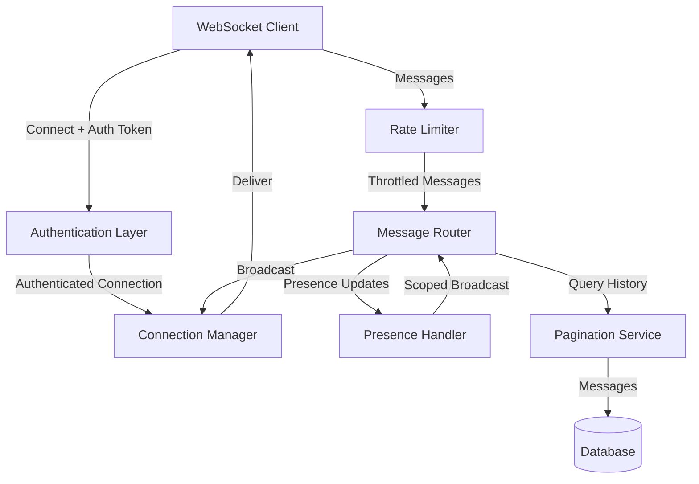

# Design Document: WebSocket Enhancements

## Overview

This design addresses critical gaps in the Aurora chat application's WebSocket infrastructure by implementing authentication enforcement, scoped broadcasting, pagination, conversation management, rate limiting, message editing/deletion, and resilient reconnection logic.

The design follows a layered architecture where authentication and rate limiting act as gatekeepers, connection management handles lifecycle and subscriptions, message routing implements scoped broadcasting, and the client implements resilient reconnection with state recovery.

## Architecture

### High-Level Architecture



### Component Responsibilities

1. **Authentication Layer**: Validates Auth_Token on connection and before message processing
2. **Rate Limiter**: Enforces message frequency limits using sliding window algorithm
3. **Connection Manager**: Maintains active connections, subscription mappings, and handles join/leave
4. **Message Router**: Routes messages to appropriate subscribers based on broadcast scope
5. **Presence Handler**: Manages typing indicators and online status with configurable timeouts
6. **Pagination Service**: Provides cursor-based message history retrieval
7. **WebSocket Client**: Implements reconnection strategy with exponential backoff

## Components and Interfaces

### Authentication Layer

```typescript
interface AuthenticationLayer {
  // Validates auth token and returns user ID or throws error
  validateToken(token: string): Promise<UserId>
  
  // Checks if token is expired
  isTokenExpired(token: string): boolean
  
  // Validates connection has valid auth before processing
  requireAuth(connectionId: ConnectionId): Promise<UserId>
}

interface AuthError {
  code: 'INVALID_TOKEN' | 'EXPIRED_TOKEN' | 'MISSING_TOKEN'
  message: string
}
```

**Implementation Notes:**
- Validate token on initial WebSocket handshake
- Store userId with connection metadata after successful auth
- Check auth before processing any client message
- Close connection immediately on auth failure

### Rate Limiter

```typescript
interface RateLimiter {
  // Checks if user can send message, returns true if allowed
  checkLimit(userId: UserId): Promise<boolean>
  
  // Records a message send for rate limiting
  recordMessage(userId: UserId): Promise<void>
  
  // Gets time until user can send next message
  getRetryAfter(userId: UserId): Promise<number>
}

interface RateLimitConfig {
  maxMessages: number      // Default: 10
  windowSeconds: number    // Default: 10
}
```

**Implementation Notes:**
- Use sliding window algorithm with Redis or in-memory store
- Track timestamps of recent messages per user
- Remove expired timestamps before checking limit
- Return retry-after time in seconds when limit exceeded

### Connection Manager

```typescript
interface ConnectionManager {
  // Registers a new authenticated connection
  registerConnection(connectionId: ConnectionId, userId: UserId): void
  
  // Removes connection and cleans up subscriptions
  removeConnection(connectionId: ConnectionId): void
  
  // Subscribes user to a channel
  joinChannel(userId: UserId, channelId: ChannelId): void
  
  // Unsubscribes user from a channel
  leaveChannel(userId: UserId, channelId: ChannelId): void
  
  // Subscribes user to a conversation
  joinConversation(userId: UserId, conversationId: ConversationId): void
  
  // Unsubscribes user from a conversation
  leaveConversation(userId: UserId, conversationId: ConversationId): void
  
  // Gets all connections for users in broadcast scope
  getConnectionsInScope(channelId?: ChannelId, conversationId?: ConversationId): ConnectionId[]
  
  // Sends message to specific connection
  sendToConnection(connectionId: ConnectionId, message: WebSocketMessage): void
}

interface SubscriptionIndex {
  // Maps userId to set of channelIds
  userChannels: Map<UserId, Set<ChannelId>>
  
  // Maps channelId to set of userIds
  channelUsers: Map<ChannelId, Set<UserId>>
  
  // Maps userId to set of conversationIds
  userConversations: Map<UserId, Set<ConversationId>>
  
  // Maps conversationId to set of userIds
  conversationUsers: Map<ConversationId, Set<UserId>>
  
  // Maps connectionId to userId
  connectionUser: Map<ConnectionId, UserId>
  
  // Maps userId to set of connectionIds (for multiple devices)
  userConnections: Map<UserId, Set<ConnectionId>>
}
```

**Implementation Notes:**
- Maintain bidirectional indexes for efficient scope resolution
- Support multiple connections per user (multiple devices)
- Clean up all subscriptions when connection closes
- Use Set data structures for O(1) membership checks

### Message Router

```typescript
interface MessageRouter {
  // Routes message to appropriate subscribers
  routeMessage(message: ChannelMessage | ConversationMessage): Promise<void>
  
  // Routes presence update to relevant users
  routePresenceUpdate(update: PresenceUpdate): Promise<void>
  
  // Routes message edit to subscribers
  routeMessageEdit(edit: MessageEdit): Promise<void>
  
  // Routes message delete to subscribers
  routeMessageDelete(delete: MessageDelete): Promise<void>
  
  // Determines broadcast scope for a message
  resolveBroadcastScope(target: ChannelId | ConversationId): UserId[]
}

interface ChannelMessage {
  type: 'channel_message'
  channelId: ChannelId
  messageId: MessageId
  userId: UserId
  content: string
  timestamp: number
}

interface ConversationMessage {
  type: 'conversation_message'
  conversationId: ConversationId
  messageId: MessageId
  userId: UserId
  content: string
  timestamp: number
}

interface MessageEdit {
  type: 'message_edit'
  messageId: MessageId
  channelId?: ChannelId
  conversationId?: ConversationId
  newContent: string
  editedAt: number
}

interface MessageDelete {
  type: 'message_delete'
  messageId: MessageId
  channelId?: ChannelId
  conversationId?: ConversationId
  deletedAt: number
}
```

**Implementation Notes:**
- Resolve broadcast scope before sending to avoid duplicate sends
- Use ConnectionManager to get relevant connections
- Validate message ownership for edits/deletes
- Include original message ID in edit/delete events

### Presence Handler

```typescript
interface PresenceHandler {
  // Records typing indicator with configurable timeout
  recordTyping(userId: UserId, channelId: ChannelId | ConversationId): void
  
  // Clears typing indicator
  clearTyping(userId: UserId, channelId: ChannelId | ConversationId): void
  
  // Gets active typing users for a channel/conversation
  getTypingUsers(channelId: ChannelId | ConversationId): UserId[]
}

interface PresenceConfig {
  typingTimeoutSeconds: number  // Default: 10
}

interface PresenceUpdate {
  type: 'typing_start' | 'typing_stop'
  userId: UserId
  channelId?: ChannelId
  conversationId?: ConversationId
  timestamp: number
}
```

**Implementation Notes:**
- Use timeout mechanism to auto-clear typing indicators
- Reset timeout on subsequent typing events from same user
- Broadcast typing_stop when timeout expires
- Store typing state per user per channel/conversation

### Pagination Service

```typescript
interface PaginationService {
  // Gets paginated messages for a channel
  getChannelMessages(
    channelId: ChannelId,
    cursor?: MessageCursor,
    limit?: number
  ): Promise<PaginatedMessages>
  
  // Gets paginated messages for a conversation
  getConversationMessages(
    conversationId: ConversationId,
    cursor?: MessageCursor,
    limit?: number
  ): Promise<PaginatedMessages>
}

interface PaginatedMessages {
  messages: Message[]
  nextCursor?: MessageCursor
  hasMore: boolean
}

interface MessageCursor {
  messageId: MessageId
  timestamp: number
}
```

**Implementation Notes:**
- Default page size: 50 messages
- Cursor contains messageId and timestamp for stable pagination
- Support forward pagination (older messages) and backward (newer messages)
- Return hasMore flag to indicate if more pages exist
- Use indexed queries on (channelId/conversationId, timestamp) for performance

### WebSocket Client Reconnection

```typescript
interface WebSocketClient {
  // Establishes connection with auth token
  connect(authToken: string): Promise<void>
  
  // Sends message through WebSocket
  send(message: ClientMessage): Promise<void>
  
  // Closes connection gracefully
  disconnect(): void
  
  // Handles automatic reconnection
  handleDisconnect(): void
}

interface ReconnectionStrategy {
  // Attempts reconnection with exponential backoff
  reconnect(): Promise<boolean>
  
  // Calculates next backoff delay
  getNextDelay(): number
  
  // Resets backoff after successful connection
  resetBackoff(): void
}

interface ReconnectionConfig {
  baseDelayMs: number        // Default: 1000
  maxAttempts: number        // Default: 5
  backoffMultiplier: number  // Default: 2
  stableConnectionSeconds: number  // Default: 30
}
```

**Implementation Notes:**
- Exponential backoff: delay = baseDelay * (multiplier ^ attemptNumber)
- Track connection duration to reset backoff after stable connection
- Re-authenticate on successful reconnection
- Rejoin all previous channels and conversations after reconnection
- Notify user when all attempts exhausted
- Provide manual reconnect button after failure

## Data Models

### Connection Metadata

```typescript
interface ConnectionMetadata {
  connectionId: ConnectionId
  userId: UserId
  authToken: string
  connectedAt: number
  lastActivity: number
}
```

### Rate Limit State

```typescript
interface RateLimitState {
  userId: UserId
  messageTimestamps: number[]  // Sliding window of timestamps
  windowStart: number
}
```

### Subscription State

```typescript
interface UserSubscriptions {
  userId: UserId
  channels: Set<ChannelId>
  conversations: Set<ConversationId>
}
```

### Typing State

```typescript
interface TypingState {
  userId: UserId
  target: ChannelId | ConversationId
  startedAt: number
  timeoutHandle: TimeoutHandle
}
```


## Correctness Properties

*A property is a characteristic or behavior that should hold true across all valid executions of a system—essentially, a formal statement about what the system should do. Properties serve as the bridge between human-readable specifications and machine-verifiable correctness guarantees.*

### Property Reflection

After analyzing all acceptance criteria, I identified several opportunities to consolidate redundant properties:

- Properties 1.1 and 1.3 both test connection closure for invalid auth - combined into single property about unauthenticated connection rejection
- Properties 1.2 and 1.4 both test error notification before closure - combined into single property about error-then-close sequence
- Properties 3.2 and 3.3 both test broadcast filtering - combined into single property about scoped delivery without duplication
- Properties 5.1 and 5.3 both test subscription functionality - combined into single property about join-then-receive
- Properties 5.2 and 5.4 both test unsubscription - combined into single property about leave/disconnect-then-no-receive
- Properties 7.2 and 7.4 both test broadcast completeness for edits/deletes - combined into single property about mutation broadcast
- Properties 7.1 and 7.3 both test ownership/permission validation - combined into single property about mutation authorization

### Authentication Properties

Property 1: Unauthenticated connections are rejected
*For any* connection attempt without a valid Auth_Token, the WebSocket_Server should close the connection and reject any message attempts
**Validates: Requirements 1.1, 1.3**

Property 2: Auth failures send error before closing
*For any* authentication failure (invalid token, expired token), the WebSocket_Server should send an error message before closing the connection
**Validates: Requirements 1.2, 1.4**

Property 3: Auth validation precedes message processing
*For any* client message, if the Auth_Token is invalid, the message should never be processed by the server
**Validates: Requirements 1.5**

### Typing Indicator Properties

Property 4: Typing indicators persist for configured duration
*For any* typing indicator event, the indicator should remain active for exactly the configured timeout duration unless reset or cleared
**Validates: Requirements 2.1, 2.5**

Property 5: Typing indicator timeout reset
*For any* sequence of typing events from the same user in the same context, each new event should reset the timeout to the full duration
**Validates: Requirements 2.3**

Property 6: Typing timeout expiration broadcasts stop event
*For any* typing indicator that reaches timeout, a typing_stop event should be broadcast to all users in the broadcast scope
**Validates: Requirements 2.4**

### Presence Broadcasting Properties

Property 7: Presence updates use scoped delivery
*For any* presence update, only users who share at least one channel or conversation with the updating user should receive the update, and each user should receive exactly one update regardless of how many contexts they share
**Validates: Requirements 3.1, 3.2, 3.3**

Property 8: Subscription index consistency
*For any* sequence of join and leave operations, the subscription index should always accurately reflect the current user-channel and user-conversation relationships
**Validates: Requirements 3.4, 3.5**

### Pagination Properties

Property 9: Page size limit enforcement
*For any* message history request, the response should contain at most 50 messages
**Validates: Requirements 4.1**

Property 10: Cursor presence in paginated responses
*For any* paginated response where more messages exist, a valid Message_Cursor should be included in the response
**Validates: Requirements 4.2**

Property 11: Pagination continuity
*For any* sequence of cursor-based pagination requests, the union of all returned messages should contain no duplicates and no gaps in the message history
**Validates: Requirements 4.3**

Property 12: End-of-pagination signaling
*For any* pagination request where no more messages exist beyond the current page, the hasMore flag should be false and no cursor should be provided
**Validates: Requirements 4.4**

Property 13: Bidirectional pagination support
*For any* message cursor, both forward pagination (older messages) and backward pagination (newer messages) should return valid, non-overlapping results
**Validates: Requirements 4.5**

### Conversation Management Properties

Property 14: Join enables message receipt
*For any* user who sends a join conversation event and is authorized, that user should receive all subsequent messages sent to that conversation
**Validates: Requirements 5.1, 5.3**

Property 15: Leave and disconnect prevent message receipt
*For any* user who sends a leave conversation event or whose connection closes, that user should not receive any subsequent messages sent to that conversation
**Validates: Requirements 5.2, 5.4**

Property 16: Join authorization enforcement
*For any* join conversation attempt, if the user lacks permission to join, the join should be rejected and the user should not receive conversation messages
**Validates: Requirements 5.5**

### Rate Limiting Properties

Property 17: Sliding window rate limit enforcement
*For any* user, if they send more than the configured maximum messages within the configured time window, subsequent messages should be rejected with a rate limit error
**Validates: Requirements 6.2, 6.3**

Property 18: Rate limit error includes retry-after
*For any* rate limit violation, the error response should include an accurate retry-after time indicating when the user can send the next message
**Validates: Requirements 6.4**

Property 19: Rate limit configuration override
*For any* custom rate limit configuration, the Rate_Limiter should enforce the configured values instead of defaults
**Validates: Requirements 6.5**

### Message Mutation Properties

Property 20: Message mutation authorization
*For any* message edit or delete attempt, the operation should only succeed if the user owns the message (for edits) or owns the message or has moderator permissions (for deletes)
**Validates: Requirements 7.1, 7.3**

Property 21: Message mutation broadcast completeness
*For any* valid message edit or delete, all users subscribed to the channel or conversation should receive the mutation event with the original message ID
**Validates: Requirements 7.2, 7.4, 7.5**

### Reconnection Properties

Property 22: Automatic reconnection on disconnect
*For any* unexpected connection loss, the WebSocket_Client should automatically attempt reconnection
**Validates: Requirements 8.1**

Property 23: Exponential backoff progression
*For any* sequence of failed reconnection attempts, the delay between attempts should follow an exponential pattern: delay = baseDelay × (multiplier ^ attemptNumber)
**Validates: Requirements 8.2**

Property 24: State recovery on successful reconnection
*For any* successful reconnection, the client should re-authenticate and rejoin all channels and conversations that were active before disconnection
**Validates: Requirements 8.4**

Property 25: Failure notification after exhausted attempts
*For any* reconnection sequence where all attempts fail, the client should notify the user and provide a manual reconnect option
**Validates: Requirements 8.5**

Property 26: Backoff reset after stable connection
*For any* successful connection that remains stable for more than the configured threshold (30 seconds), the backoff delay should reset to the base delay
**Validates: Requirements 8.6**

## Error Handling

### Authentication Errors

- **Invalid Token**: Close connection with error code `INVALID_TOKEN`
- **Expired Token**: Close connection with error code `EXPIRED_TOKEN`
- **Missing Token**: Close connection with error code `MISSING_TOKEN`
- **Unauthenticated Message**: Reject message, send error, close connection

### Rate Limiting Errors

- **Rate Limit Exceeded**: Reject message with error code `RATE_LIMIT_EXCEEDED` and `retryAfter` field
- Keep connection open (don't close on rate limit)

### Authorization Errors

- **Unauthorized Join**: Reject join with error code `UNAUTHORIZED`
- **Unauthorized Edit**: Reject edit with error code `NOT_OWNER`
- **Unauthorized Delete**: Reject delete with error code `NOT_OWNER_OR_MODERATOR`

### Pagination Errors

- **Invalid Cursor**: Return error code `INVALID_CURSOR`
- **Channel Not Found**: Return error code `CHANNEL_NOT_FOUND`
- **Conversation Not Found**: Return error code `CONVERSATION_NOT_FOUND`

### Connection Errors

- **Reconnection Failed**: After max attempts, emit `reconnection_failed` event
- **Connection Timeout**: Emit `connection_timeout` event and attempt reconnection

## Testing Strategy

### Dual Testing Approach

This feature requires both unit tests and property-based tests to ensure comprehensive coverage:

- **Unit tests** verify specific examples, edge cases, and error conditions
- **Property tests** verify universal properties across all inputs through randomization
- Together they provide comprehensive coverage: unit tests catch concrete bugs, property tests verify general correctness

### Property-Based Testing Configuration

We will use **fast-check** (for TypeScript/JavaScript) as our property-based testing library. Each property test will:

- Run a minimum of 100 iterations to ensure thorough randomized coverage
- Be tagged with a comment referencing the design document property
- Tag format: `// Feature: websocket-enhancements, Property N: [property text]`
- Each correctness property will be implemented by a single property-based test

### Unit Testing Focus

Unit tests should focus on:

- Specific examples that demonstrate correct behavior (e.g., default timeout of 10 seconds, max 5 reconnection attempts)
- Edge cases (e.g., empty message history, single message in channel, connection closes during pagination)
- Error conditions (e.g., invalid auth token formats, malformed cursors, permission denied scenarios)
- Integration points between components (e.g., auth layer → connection manager → message router)

Avoid writing too many unit tests for scenarios that property tests already cover through randomization.

### Test Coverage by Component

**Authentication Layer:**
- Property tests: Auth validation, token expiration, message rejection
- Unit tests: Specific token formats, error message content, connection close timing

**Rate Limiter:**
- Property tests: Sliding window enforcement, configuration override
- Unit tests: Exact boundary conditions (10th vs 11th message), retry-after calculation

**Connection Manager:**
- Property tests: Subscription index consistency, join/leave operations
- Unit tests: Multiple connections per user, cleanup on disconnect

**Message Router:**
- Property tests: Scoped broadcasting, deduplication, mutation broadcast
- Unit tests: Specific channel/conversation scenarios, empty subscriber lists

**Presence Handler:**
- Property tests: Timeout duration, reset behavior, stop event broadcast
- Unit tests: Default 10-second timeout, concurrent typing from multiple users

**Pagination Service:**
- Property tests: Page size limits, cursor continuity, bidirectional pagination
- Unit tests: Empty history, single page, last page detection

**WebSocket Client:**
- Property tests: Exponential backoff, state recovery, backoff reset
- Unit tests: Max 5 attempts, 30-second stability threshold, manual reconnect UI

### Example Property Test Structure

```typescript
// Feature: websocket-enhancements, Property 11: Pagination continuity
describe('Pagination continuity', () => {
  it('should return no duplicates and no gaps across pages', async () => {
    await fc.assert(
      fc.asyncProperty(
        fc.array(fc.record({ id: fc.uuid(), content: fc.string() }), { minLength: 100 }),
        async (messages) => {
          // Setup: Insert messages into database
          await insertMessages(channelId, messages);
          
          // Action: Paginate through all messages
          const retrieved = [];
          let cursor = undefined;
          do {
            const page = await paginationService.getChannelMessages(channelId, cursor, 50);
            retrieved.push(...page.messages);
            cursor = page.nextCursor;
          } while (cursor);
          
          // Assert: No duplicates
          const ids = retrieved.map(m => m.id);
          expect(new Set(ids).size).toBe(ids.length);
          
          // Assert: No gaps (all original messages present)
          expect(ids.sort()).toEqual(messages.map(m => m.id).sort());
        }
      ),
      { numRuns: 100 }
    );
  });
});
```
